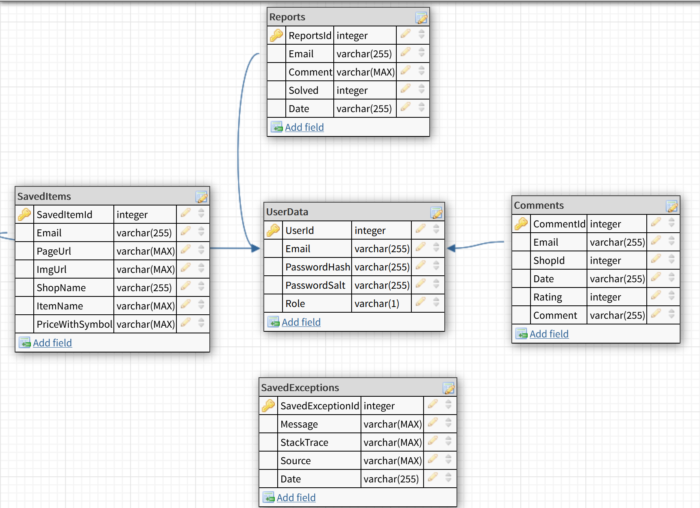
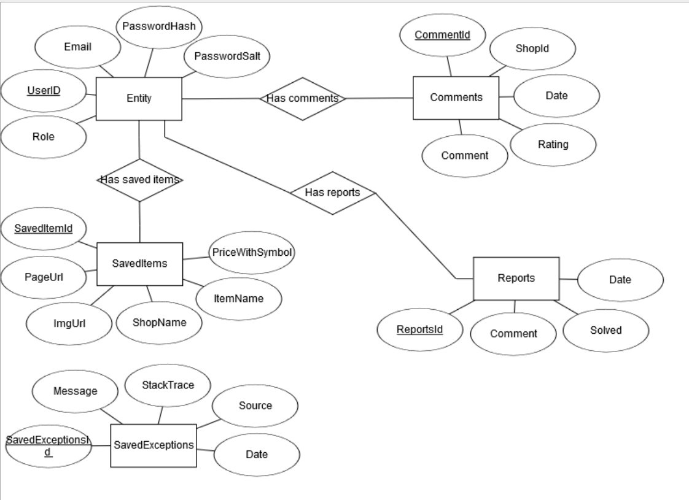

# How to run the program
"PCE_Web" dešinis klavišas -> "Manage User Secrets"

Pridėti šitai:

{
    "EmailSend": {
        "SecretMail": "Jūsų email",
        "SecretPassword": "Jūsų susikurto email slaptažodis"       
    } 
}

Kad teisingai paleisti - reikia nustatyti šiuos nustatymus:

"Solution 'PCE_Web' (3 of 3 projects)" dešinis klavišas -> "Properties"\
Kairėje: "Common Properties" -> "Startup Project"\
Viduryje: "Multiple startup projects":\
- PCE_Web - action: "Start"
- PCEDatabase - action: "None"
- WEBSearchAPI - action: "Start"

# Price comparison engine
### Students working on the project: 
- Juozas Vainauskas
- Ernestas Ščevinskas
- Aivaras Rinkevičius
- Justas Vitkauskas
## About the project (key tasks)
**Front-End**
- [x] Switch platform to an app
- [x] Switch platform to a website
- [x] Register/login forms
- [x] Search field
- [x] FAQ
- [x] Contacts
- [x] Searched products' list/Interface
- [x] Slideshow
- [x] Stars/comments under the shops
- [x] Saving products
- [x] Admin panel
- [x] Report

**Back-End**
- [x] Switch platform to an app
- [x] Transfer/update data using DataTable and DataAdapter.
- [x] Select/insert/update/delete usage. (Entity framework usage?)
- [x] LINQ usage: Join, Group, Skip and Take, Agregate function.
- [x] Switch platform to a website
- [x] Gather data from online shop websites
- [x] Compare the gathered data
- [x] Password hashing/encryption
- [x] Register and login forms' error catching
- [x] Email confirm and password reset
- [x] Store gathered data in the database
- [x] Slideshow
- [x] Products' list cashing
- [x] Stars/comments under the shops
- [x] Saving products
- [x] Admin panel
- [x] Report

## Initial goal
Create a program/website/app which takes the data of the prices from different shopping websites and provides a comparison in a visual manner

## Database diagrams

